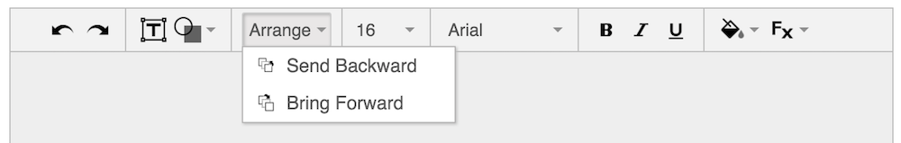

# gToolbars.js

gToolbars.js is a javascript library for creating toolbars that have the same visual style as Google Docs, Sheets, Slides, etc. It handles the CSS styles and dropdowns logistics for you. I made this library for my web-based image editor.



### Usage

1. Include the CSS and JS files:

  ```html
  <link rel="stylesheet" type="text/css" href="gToolbars-0.2.0.css">
  <script defer src="gToolbars-0.2.0.js"></script>
  ```

2. Add a toolbar to the HTML:

  ```html
  <div class="gt-toolbar">
    <div id="toolbar-undo" class="gt-button"></div>
    <div class="mdl-tooltip mdl-tooltip--large gt-noselect" for="toolbar-undo">Undo</div>
    
    <div class="gt-separator"></div>
    
    <div id="toolbar-shape" class="gt-button gt-dropdown">
      <div class="gt-arrow"></div>
      <div class="gt-submenu gt-noselect gt-noshow">
        <div class="gt-submenu-item" id="toolbar-circle">
          
          Circle
        </div>
        <div class="gt-submenu-item" id="toolbar-rectangle">
          
          Rectangle
        </div>
      </div><!-- /toolbar-submenu -->
    </div><!-- /toolbar-shape -->
    <div class="mdl-tooltip mdl-tooltip--large gt-noselect" for="toolbar-shape">Insert Shape</div>
  </div><!-- /toolbar -->
  ```

3. Add images to the buttons:

  ```css
  #toolbar-undo {
    background-image: url("./icons/undo.png");
  }
  
  #toolbar-shape {
    background-image: url("./icons/shapes.png");
  }
  ```

4. Register button actions:

  ```javascript
  registerButton($("#toolbar-undo"), function() {
    // pressed undo
  });
  ```

### Dependencies

- jQuery
- [Material Design Lite](https://www.getmdl.io/) if you want tooltips
- [Spectrum](https://bgrins.github.io/spectrum/) if you want a color picker

### Browser Support

- [X] Firefox 44
- [X] Chrome 49
- [X] Safari 9.1
- [X] IE 9+ (with correct doctype)
- [X] Mobile Safari
- [ ] **Untested:** Android Browser
- [ ] **Untested:** IE 8

### Generating the CSS

If you make changes to the SASS, you'll need to regenerate the CSS:

```
sass gToolbars-0.2.0.scss > gToolbars-0.2.0.css
```

### Open Issues

- [ ] Remove jQuery dependency
- [ ] Remove Material Design Lite dependency by implementing tooltips
- [ ] Implement CommonJS and AMD compatibility
- [ ] Switch to a single PNG image containing all icons
